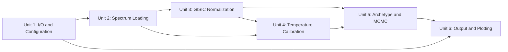

# Unit of Work Dependency

## Dependency Matrix

| Unit | Depends On | Blocks (Must Complete Before) |
|---|---|---|
| Unit 1 — I/O & Configuration | (none) | Units 2, 3, 4, 5, 6 |
| Unit 2 — Spectrum Loading & Preprocessing | Unit 1 | Units 3, 4, 5, 6 |
| Unit 3 — GISIC Normalization | Unit 2 | Units 4, 5, 6 |
| Unit 4 — Temperature Calibration & Extinction | Units 2, 3 | Units 5, 6 |
| Unit 5 — Archetype Classification & MCMC | Units 3, 4 | Unit 6 |
| Unit 6 — Output Generation & Plotting | Units 1–5 | (none — last unit) |

## Update Sequence (Strictly Sequential, per Q2 = A)

Each unit must reach a fully-verified state (code complete, unit tests passing, regression baseline diff passing within tolerance) before the next unit in sequence begins. This is a hard gate, not a suggestion, per Q2 = A.

## Coordination Points
- **Shared state contract**: All units read/write the same `Spectrum` object attributes (see [../application-design/component-dependency.md](../application-design/component-dependency.md)). Any unit that changes what it stores on `Spectrum` must not break the attribute contract relied upon by later units in the sequence.
- **Shared regression baseline**: All units are verified against the same baseline captured once, before Unit 1 begins (per requirements.md NFR-1), from `casper/inputs/spectra/test_spectra/`.
- **No parallel branches this cycle**: Per Q3 = A (solo), there is no need for cross-branch coordination; each unit's commit builds directly on the previous unit's completed, verified state.

## Testing Checkpoints
Per Q2 = A, at the end of each unit:
1. Unit-specific tests pass (new + existing)
2. Full `main.py` run against `casper/inputs/spectra/test_spectra/` completes without error
3. Regression diff of all output files against the pre-Unit-1 baseline passes within the tolerance defined in requirements.md NFR-1
4. Only then does the next unit begin
