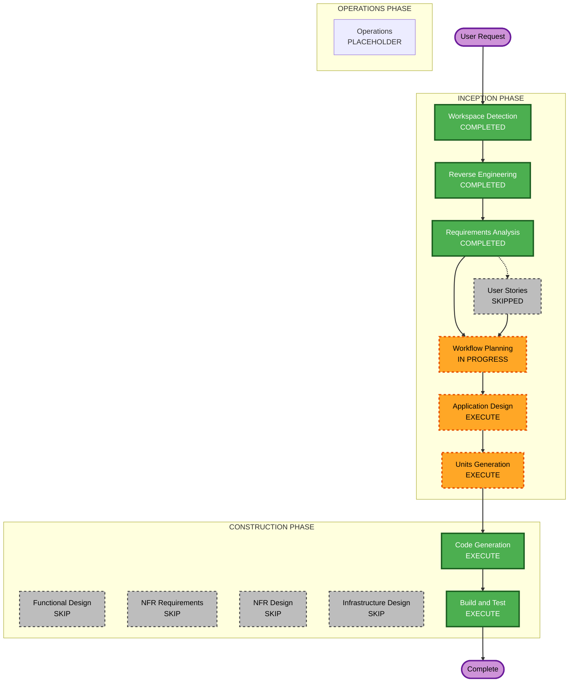

# Execution Plan

## Detailed Analysis Summary

### Transformation Scope (Brownfield)
- **Transformation Type**: Single-system internal refactor (no architectural transformation, no deployment model change, no infrastructure involved)
- **Primary Changes**: Incremental refactoring of `casper.interface` pipeline modules and their test coverage, guided by documented business rules from Reverse Engineering
- **Related Components**: All 6 units identified below; `casper/tests/` test suite; CI (`ci.yml`) gains a dependency vulnerability scan step

### Change Impact Assessment
- **User-facing changes**: No — CLI usage (`python main.py`), config format, and output file formats/contents remain unchanged (NFR-1)
- **Structural changes**: Yes — internal code structure/organization may change within existing module boundaries (no new components)
- **Data model changes**: No — `Spectrum` object fields, parameter file schema, and output file schemas are unchanged
- **API changes**: No — no new public interfaces; internal method signatures may be refactored but observable behavior must not change
- **NFR impact**: Yes — adds property-based tests (Hypothesis), a CI vulnerability scan step, and formalizes a regression baseline-diff test

### Component Relationships (Brownfield)
```markdown
## Component Relationships
- **Primary Components**: casper.interface (batch.py, spectrum.py, gisic/, temp_calibrations.py, EW.py, MAD.py, ac.py, interface_main.py, MCMC_interface.py, MLE_priors.py, synthetic_functions.py, plot_functions.py)
- **Infrastructure Components**: None (no CDK/Terraform/cloud infra)
- **Shared Components**: casper.interface.libraries (pickled grids, read-only, not refactored), casper.user_config, casper.interface.config
- **Dependent Components**: casper/tests/** (must continue passing; will gain new PBT + regression tests)
- **Supporting Components**: casper/utils/logger_config.py (logging), .github/workflows/ci.yml (gains vulnerability scan step)
```

For each related component:
- **casper.interface.batch (Batch)**: Change Type — Major (highest risk, currently untested, orchestrates everything); Change Reason — direct dependency of every stage; Change Priority — Critical
- **casper.interface.spectrum (Spectrum)**: Change Type — Major (currently untested); Change Reason — core domain object used by all stages; Change Priority — Critical
- **casper.interface.interface_main**: Change Type — Major (currently untested, MCMC/classification core); Change Reason — scientific engine; Change Priority — Critical
- **casper.interface.gisic**: Change Type — Minor (already tested); Change Reason — dependency of normalization step; Change Priority — Important
- **casper.interface.temp_calibrations / EW / MAD / ac**: Change Type — Minor (already tested); Change Priority — Important
- **casper.interface.plot_functions**: Change Type — Minor (untested, but output-only/visual); Change Priority — Optional
- **casper.interface.config / user_config**: Change Type — Configuration-only; Change Priority — Optional

### Risk Assessment
- **Risk Level**: Medium — no architectural change, but the scientific correctness bar is high (published-paper-tied results) and 4 of the riskiest modules have zero existing test coverage
- **Rollback Complexity**: Easy — git-based, per-unit commits; no deployed state to roll back
- **Testing Complexity**: Moderate — requires numeric regression-diff tooling in addition to normal unit tests

## Workflow Visualization



## Phases to Execute

### INCEPTION PHASE
- [x] Workspace Detection (COMPLETED)
- [x] Reverse Engineering (COMPLETED)
- [x] Requirements Analysis (COMPLETED)
- [x] User Stories (SKIPPED — refactor-only cycle, no new user-facing feature; confirmed via Requirements Analysis Q1)
- [x] Workflow Planning (IN PROGRESS — this document)
- [ ] Application Design — **EXECUTE**
  - **Rationale**: Per hybrid rollout decision, formally document existing component/method responsibilities and business rules (archetype classification logic, calibration formulas) even though no new components are introduced — required prerequisite for Units Generation
- [ ] Units Generation — **EXECUTE**
  - **Rationale**: Decompose the refactor into 6 independently workable/testable units, per hybrid rollout decision

### CONSTRUCTION PHASE
- [ ] Functional Design — **SKIP** (per unit)
  - **Rationale**: Hybrid rollout keeps Construction lightweight; no new business logic is being introduced, so per-unit functional design would restate what Application Design already captures
- [ ] NFR Requirements — **SKIP** (per unit)
  - **Rationale**: NFRs already captured at the Requirements Analysis level (NFR-1 through NFR-6) and apply uniformly across units
- [ ] NFR Design — **SKIP** (per unit)
  - **Rationale**: Same as above — no per-unit NFR design needed beyond what's already documented
- [ ] Infrastructure Design — **SKIP** (per unit)
  - **Rationale**: No infrastructure exists or is being introduced
- [ ] Code Generation — **EXECUTE (ALWAYS)**
  - **Rationale**: Refactor implementation, governed by `.github/instructions/casper-python-style.instructions.md` and requirements.md NFRs
- [ ] Build and Test — **EXECUTE (ALWAYS)**
  - **Rationale**: Comprehensive per hybrid decision — unit tests, integration test, regression baseline diff, property-based tests, CI vulnerability scan

### OPERATIONS PHASE
- [ ] Operations — PLACEHOLDER
  - **Rationale**: No deployment/monitoring target for a local scientific package

## Package/Unit Change Sequence (Brownfield)

Sequenced primarily by **dependency order** (foundational units first), while ensuring the **highest-risk, untested modules** (NFR-3: `batch.py`, `interface_main.py`, `spectrum.py`) each gain test coverage as soon as their unit is touched, rather than being deferred to the end:

1. **Unit 1 — I/O & Configuration** (`user_config.py`, `io_paths.py`, `config.py`) — foundational; no dependencies on other units
2. **Unit 2 — Spectrum Loading & Preprocessing** (`spectrum.py`, plus the relevant slice of `batch.py`: `load_spectra`, `set_params`, `radial_correct`, `build_frames`) — depends on Unit 1; **adds first tests for `spectrum.py`**
3. **Unit 3 — GISIC Normalization** (`gisic/`, plus `batch.py: normalize`) — depends on Unit 2's frame data; already has test coverage to build on
4. **Unit 4 — Temperature Calibration & Extinction** (`temp_calibrations.py`, `EW.py`, `MAD.py`, `ac.py`, plus `batch.py: ebv_correction, calibrate_temperatures, set_KP_bounds, set_carbon_mode, estimate_sn, get_sn`) — depends on Units 2–3
5. **Unit 5 — Archetype Classification & MCMC** (`interface_main.py`, `MCMC_interface.py`, `MLE_priors.py`, `synthetic_functions.py`, plus `batch.py: archetype_classification, mcmc_determination, estimate_logg, generate_synthetic`) — depends on Units 3–4; **adds first tests for `interface_main.py`**; highest scientific-risk unit
6. **Unit 6 — Output Generation & Plotting** (`plot_functions.py`, plus `batch.py: generate_output_spectra, generate_output_files, generate_plots`) — depends on all prior units

`batch.py` itself is touched incrementally within each unit above (only the methods relevant to that unit); a final cross-cutting pass adds integration-level tests for `Batch` as a whole during Build and Test, since it currently has no test coverage at all.

## Estimated Timeline
- **Total Phases**: 2 remaining Inception stages (Application Design, Units Generation) + 6 Construction units (Code Generation only) + 1 Build & Test phase
- **Estimated Duration**: Not time-boxed — scientific correctness verification (regression diffing) paces each unit rather than a fixed schedule

## Success Criteria
- **Primary Goal**: Refactor CASPER's pipeline modules for maintainability without changing scientific outputs
- **Key Deliverables**: Application Design docs; unit-of-work docs; refactored code per unit with NumPy/astropy docstrings; new unit tests for previously-untested modules; Hypothesis-based property tests; automated regression baseline diff; CI vulnerability scan step
- **Quality Gates**: (1) all existing tests still pass, (2) new tests added for previously-untested modules touched by each unit, (3) regression diff against baseline outputs passes within tolerance, (4) docstring/comment preservation rules followed, (5) README updated only where user-visible behavior changed
- **Integration Testing**: Full `main.py` run against `casper/inputs/spectra/test_spectra/` after each unit and at the end of Construction
