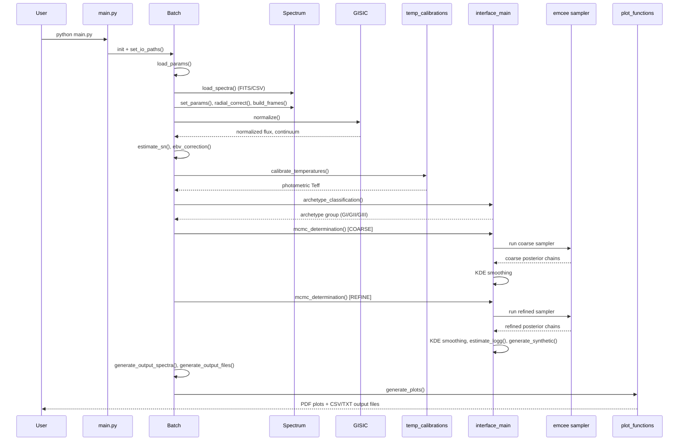

# System Architecture

## System Overview

CASPER is a single-package, monolithic Python scientific application (not a distributed system). It runs as a local batch-processing script (`python casper/main.py`) that orchestrates a sequential astrophysical analysis pipeline over one or more input spectra, producing files on local disk. There is no network service, database, or deployed infrastructure — configuration and I/O are entirely file/environment-variable based.

## Architecture Diagram

```mermaid
flowchart TD
    subgraph Entry["Entry Point"]
        Main["main.py"]
    end

    subgraph Orchestration["Orchestration Layer"]
        Batch["Batch (batch.py)"]
    end

    subgraph DomainModel["Domain Model"]
        Spectrum["Spectrum (spectrum.py)"]
    end

    subgraph ScientificModules["Scientific Processing Modules"]
        GISIC["GISIC Normalization (gisic/)"]
        TempCal["Temperature Calibration (temp_calibrations.py)"]
        EW["Equivalent Width and Carbon Mode (EW.py)"]
        AC["Carbon Abundance Conversion (ac.py)"]
        MAD["Robust Statistics (MAD.py)"]
        MCMCIf["MCMC Likelihood Functions (MCMC_interface.py)"]
        IfMain["MCMC Orchestration and Classification (interface_main.py)"]
        Priors["Priors (MLE_priors.py)"]
        Synth["Synthetic Spectrum Interpolation (synthetic_functions.py)"]
        Plots["Plotting (plot_functions.py)"]
    end

    subgraph Config["Configuration Layer"]
        UserConfig["user_config.py + user_config.json"]
        ConfigConst["config.py constants"]
        Logger["logger_config.py"]
    end

    subgraph ExternalData["External Data (Git LFS)"]
        SynthGrid["SYNTHETIC_SPEC_R2000_INTERP.pkl"]
        GravGrid["grav_interp.pkl (Y-squared isochrones)"]
        ArchetypeGrid["MASTER_spec_interp.pkl"]
    end

    subgraph InputData["Input Data"]
        ParamFile["Parameter CSV file"]
        SpectraFiles["Spectra FITS/CSV files"]
    end

    subgraph OutputData["Output Data"]
        OutCSV["*_out.csv"]
        SNRCsv["*_snr.csv"]
        TempTable["*_temp_cal_table.txt"]
        ArchTable["*_archetype_likelihood_table.txt"]
        SpecCSV["*_spectra_output.csv"]
        SpecPDF["*_spec.pdf"]
        CornerPDF["*_corner_plot_*.pdf"]
        TracePDF["*_trace_plot_*.pdf"]
    end

    Main --> Batch
    Batch --> Spectrum
    Batch --> GISIC
    Batch --> TempCal
    Batch --> EW
    Batch --> IfMain
    Batch --> Plots
    IfMain --> MCMCIf
    IfMain --> Synth
    IfMain --> Priors
    MCMCIf --> Priors
    TempCal --> AC
    EW --> MAD

    Batch --> UserConfig
    Batch --> ConfigConst
    Batch --> Logger

    Synth --> SynthGrid
    IfMain --> GravGrid
    IfMain --> ArchetypeGrid

    ParamFile --> Batch
    SpectraFiles --> Batch

    Batch --> OutCSV
    Batch --> SNRCsv
    Batch --> TempTable
    Batch --> ArchTable
    Batch --> SpecCSV
    Plots --> SpecPDF
    Plots --> CornerPDF
    Plots --> TracePDF
```

## Component Descriptions

### `main.py`
- **Purpose**: Program entry point.
- **Responsibilities**: Instantiate `Batch`, invoke its methods in the fixed pipeline order, log total runtime.
- **Dependencies**: `Batch`, `user_config`, `logger_config`.
- **Type**: Application (entry point).

### `Batch` (`casper/interface/batch.py`)
- **Purpose**: Orchestrates the multi-spectrum processing pipeline end-to-end.
- **Responsibilities**: I/O path resolution, parameter/spectra loading, invoking every downstream scientific stage per spectrum, output file generation.
- **Dependencies**: `Spectrum`, `EW`, `config`, `interface_main`, `plot_functions`, `temp_calibrations`, GISIC `normalize`, `user_config`.
- **Type**: Application (orchestration layer).

### `Spectrum` (`casper/interface/spectrum.py`)
- **Purpose**: In-memory representation of a single star's spectrum and derived quantities.
- **Responsibilities**: Store raw/processed spectral data, photometry, S/N stats, MCMC results, adopted parameters; expose getters used by `Batch` and output generation.
- **Dependencies**: None beyond numpy/pandas/astropy for data handling.
- **Type**: Domain model.

### GISIC package (`casper/interface/gisic/`)
- **Purpose**: Continuum normalization of observed and synthetic spectra.
- **Responsibilities**: Inflection-point segmentation (`spectrum.py`), segment statistics (`segment.py`), molecular-band detection (`norm_functions.py`), top-level `normalize()` entry point.
- **Dependencies**: scipy (spline fitting), numpy.
- **Type**: Shared/library module.

### Temperature & Carbon Diagnostics (`temp_calibrations.py`, `EW.py`, `ac.py`, `MAD.py`)
- **Purpose**: Derive photometric Teff estimates and carbon-mode/abundance-conversion diagnostics.
- **Dependencies**: numpy, scipy (integration for equivalent widths).
- **Type**: Shared/library modules.

### Parameter Estimation (`MCMC_interface.py`, `interface_main.py`, `MLE_priors.py`, `synthetic_functions.py`)
- **Purpose**: Bayesian parameter estimation via MCMC against synthetic spectral models; archetype classification; surface gravity estimation.
- **Dependencies**: `emcee` (sampler), `statsmodels` (KDE), scipy (optimization/interpolation), pickled spectral/isochrone grids from `casper/interface/libraries/`.
- **Type**: Application (core scientific engine).

### Reporting (`plot_functions.py`)
- **Purpose**: Generate diagnostic plots (spectral fits, corner plots, trace plots).
- **Dependencies**: matplotlib, `corner`.
- **Type**: Shared/library module.

### Configuration (`user_config.py`, `config.py`, `logger_config.py`)
- **Purpose**: Centralize user-editable configuration (paths, I/O), scientific constants (wavelength bounds, archetype parameters, extinction coefficients), and logging setup.
- **Type**: Cross-cutting/config layer.

## Data Flow

## Integration Points

- **External APIs**: None — CASPER is a standalone local batch tool with no network calls.
- **Databases**: None — all state is file-based (CSV/FITS input, CSV/TXT/PDF/NPY output).
- **Third-party Services**: None at runtime. Git LFS is used at development/distribution time to store large pickled spectral-grid files (`casper/interface/libraries/*.pkl`), pulled via `git lfs pull`.

## Infrastructure Components

- **CDK Stacks / Cloud Infrastructure**: Not applicable — no deployment infrastructure exists or is required for this local scientific package.
- **Deployment Model**: Pip-installable Python package (`pip install .` / `pip install -e .`), run locally by researchers via `python main.py`.
- **Networking**: Not applicable.
