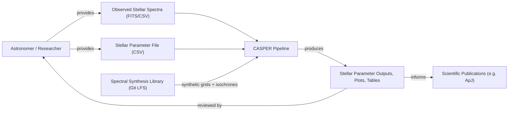

# Business Overview

## Business Context Diagram

## Business Description

- **Business Description**: CASPER (Chemical Abundance and Stellar Parameter Estimation Routine) is a scientific analysis package that determines reliable stellar parameters — effective temperature (Teff), metallicity ([Fe/H]), surface gravity (log g), and carbon abundance ([C/Fe] / A(C)) — for cool, Carbon-Enhanced Metal-Poor (CEMP) stars from low/medium-resolution stellar spectra. The methodology is described in Yoon, Whitten, et al. 2020 (ApJ, 894, 7) and used in related work (e.g. Placco et al. 2020, ApJ, 897, 78).
- **Business Transactions**:
  1. **Ingest a batch of stellar spectra + parameter metadata** — read FITS/CSV spectra and a CSV parameter file describing each target star (colors, class, mode, carbon mode, MCMC settings).
  2. **Prepare spectra for analysis** — radial velocity correction, wavelength trimming, and continuum normalization (GISIC algorithm).
  3. **Estimate photometric temperature** — combine multiple published photometric-color-to-Teff calibrations (Bergeat, Hernandez, Casagrande, Fukugita) into an adopted Teff prior.
  4. **Classify CEMP archetype group** — determine which of three gravity/abundance archetype groups (GI/GII/GIII, in HALO or UFD galactic environment mode) best matches the observed spectrum via likelihood comparison to synthetic spectra.
  5. **Estimate final stellar parameters via MCMC** — run a two-stage (coarse → refine) Markov Chain Monte Carlo (via `emcee`) Bayesian fit of Teff, [Fe/H], [C/Fe], and noise parameters against the Ca II K and CH (and optionally C2) spectral features.
  6. **Estimate surface gravity** — interpolate log g from the fitted Teff/[Fe/H] using a Yale-Yonsei (Y²) stellar isochrone grid.
  7. **Generate scientific outputs** — parameter tables, SNR tables, temperature calibration tables, archetype likelihood tables, observed-vs-synthetic spectra tables, and diagnostic plots (spectral fits, MCMC corner plots, trace plots) for scientific interpretation and publication.
- **Business Dictionary**:
  - **CEMP star**: Carbon-Enhanced Metal-Poor star — a metal-poor star with an overabundance of carbon relative to iron.
  - **Teff**: Effective temperature of a star, in Kelvin.
  - **[Fe/H]**: Logarithmic metallicity relative to solar.
  - **[C/Fe]**: Logarithmic carbon-to-iron abundance ratio.
  - **A(C)**: Absolute carbon abundance, $A(C) = [C/Fe] + [Fe/H] + 8.43$ (solar reference, Asplund 2009).
  - **log g**: Logarithm (base 10) of stellar surface gravity.
  - **Archetype group (GI/GII/GIII)**: Three reference CEMP classes with characteristic [Fe/H]/[C/Fe] combinations, used to seed and validate the MCMC fit.
  - **HALO / UFD mode**: Two galactic environment contexts (Milky Way halo vs. Ultra-Faint Dwarf galaxy) with different archetype parameter sets.
  - **GISIC**: The continuum normalization algorithm used to normalize observed and synthetic spectra via inflection-point segmentation.
  - **Coarse / Refine MCMC**: Two-stage MCMC strategy — an initial broad exploration ("coarse") followed by a narrower, higher-precision fit ("refine") seeded from the coarse result.
  - **KP bounds**: Wavelength integration bounds for the Ca II K line, used for line-strength and S/N estimation.

## Component Level Business Descriptions

### Batch Orchestration (`casper/interface/batch.py`)
- **Purpose**: Coordinates the entire multi-star processing pipeline from raw input to final output artifacts.
- **Responsibilities**: I/O path resolution, parameter/spectra loading, sequencing of every downstream scientific stage per star, output file generation.

### Spectrum Representation (`casper/interface/spectrum.py`)
- **Purpose**: Represents a single star's spectrum and all derived scientific quantities.
- **Responsibilities**: Holds raw and processed spectral data, photometric colors, S/N statistics, MCMC results, and adopted stellar parameters for one star.

### Continuum Normalization (`casper/interface/gisic/`)
- **Purpose**: Removes the stellar continuum from observed/synthetic flux so spectral features can be measured on a common scale.
- **Responsibilities**: Inflection-point segmentation, robust (MAD-based) continuum point selection, spline continuum fitting.

### Temperature & Carbon Diagnostics (`temp_calibrations.py`, `EW.py`, `ac.py`, `MAD.py`)
- **Purpose**: Derive photometric temperature estimates and carbon-mode/abundance diagnostics used as priors and classifiers.

### Parameter Estimation (`MCMC_interface.py`, `interface_main.py`, `MLE_priors.py`, `synthetic_functions.py`)
- **Purpose**: Performs the Bayesian (MCMC) fit of stellar parameters against synthetic spectral models, including archetype classification and surface gravity estimation.

### Reporting (`plot_functions.py`, output CSV/table writers in `batch.py`/`spectrum.py`)
- **Purpose**: Produces the final human/scientist-facing artifacts (tables and plots) used to interpret and publish results.
