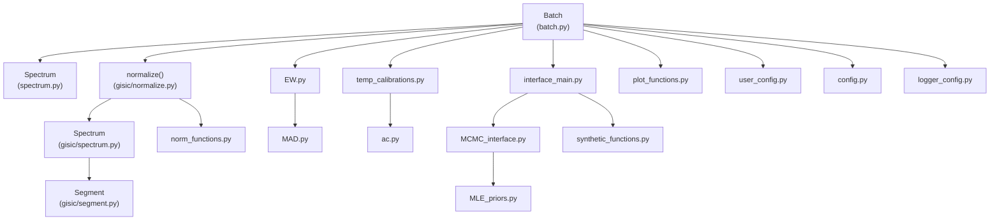

# Code Structure

## Build System

- **Type**: setuptools (PEP 517/518) with `setuptools_scm` for git-tag-based versioning.
- **Configuration**: [pyproject.toml](../../../pyproject.toml) defines build backend, dependencies, optional extras (`dev`, `test`, `docs`, `all`), ruff lint config, pytest config, and coverage config. [setup.py](../../../setup.py) is a thin `setuptools.setup()` shim for compatibility. Version is written to `casper/_version.py` at build time.

## Key Classes/Modules

### Existing Files Inventory

| Path | Purpose |
|------|---------|
| `casper/main.py` | Entry point; runs the full pipeline in sequence |
| `casper/_version.py` | Auto-generated version file (setuptools_scm) |
| `casper/__init__.py` | Package init |
| `casper/user_config.py` | Config loader (JSON + env var overrides) |
| `casper/user_config.json` / `user_config.example.json` | User-editable I/O configuration |
| `casper/interface/batch.py` | `Batch` class — pipeline orchestration |
| `casper/interface/spectrum.py` | `Spectrum` class — per-star data/state |
| `casper/interface/config.py` | Scientific constants (wavelength bounds, archetype params, extinction coefficients) |
| `casper/interface/io_paths.py` | Path-resolution helpers |
| `casper/interface/EW.py` | Equivalent width + carbon mode classification |
| `casper/interface/MAD.py` | Median absolute deviation statistics |
| `casper/interface/ac.py` | A(C) ↔ [C/Fe] conversion |
| `casper/interface/temp_calibrations.py` | Photometric temperature calibrations |
| `casper/interface/MCMC_interface.py` | MCMC likelihood functions |
| `casper/interface/MLE_priors.py` | Prior probability functions |
| `casper/interface/interface_main.py` | MCMC orchestration, archetype classification, log g estimation, synthetic spectrum generation |
| `casper/interface/synthetic_functions.py` | Synthetic spectrum interpolation/normalization, chi-squared likelihood helpers |
| `casper/interface/plot_functions.py` | Diagnostic plotting (spectra, corner, trace plots) |
| `casper/interface/gisic/normalize.py` | GISIC top-level entry point |
| `casper/interface/gisic/spectrum.py` | GISIC internal spectrum representation and segmentation logic |
| `casper/interface/gisic/segment.py` | Segment statistics (MAD, continuum candidacy) |
| `casper/interface/gisic/norm_functions.py` | Molecular-band detection helpers |
| `casper/interface/libraries/` | Pickled spectral/isochrone grids (Git LFS) |
| `casper/inputs/params/CASPER_params.py` | Parameter file format documentation/placeholder |
| `casper/inputs/params/param_file_test.dat` (implied) | Test parameter CSV |
| `casper/inputs/spectra/test_spectra/*` | Test spectra (FITS/CSV) |
| `casper/utils/logger_config.py` | Dual console/file logger setup |
| `casper/utils/not_used/*` | Deprecated/legacy code — **not part of the active pipeline** (see Design Patterns note below) |
| `casper/tests/**` | pytest test suite |

## Design Patterns

### Batch/Orchestrator Pattern
- **Location**: `Batch` class in `batch.py`.
- **Purpose**: Single class sequences every pipeline stage across all loaded spectra, keeping stage ordering explicit and centralized (mirrored in `main.py`).
- **Implementation**: Each pipeline stage is a `Batch` method that loops over `self.spectra_array` and delegates to a stage-specific module/function.

### Rich Domain Object Pattern
- **Location**: `Spectrum` class.
- **Purpose**: Each star's full analysis state (raw data, normalization, S/N, MCMC results, adopted parameters) lives on one object, avoiding scattered dictionaries/parallel arrays.

### Two-Stage Bayesian Refinement Pattern
- **Location**: `mcmc_determination()` (`interface_main.py`, invoked from `Batch`).
- **Purpose**: Coarse MCMC run (broad exploration, more free parameters) followed by a refine run seeded from the coarse KDE peak, improving convergence and precision.

### Pluggable Calibration Set Pattern
- **Location**: `temp_calibrations.py`.
- **Purpose**: Multiple independent photometric-to-Teff calibrations (Bergeat, Hernandez, Casagrande, Fukugita) are computed and reconciled into a single adopted value, allowing cross-validation.

### Legacy/Deprecated Module Convention
- **Location**: `casper/utils/not_used/`.
- **Purpose**: Superseded implementations are quarantined under `not_used/` rather than deleted, signaling they are not part of the active pipeline but are kept for reference.

## Critical Dependencies

### emcee (3.1.6)
- **Usage**: `interface_main.py` — Ensemble MCMC sampler for coarse and refine parameter estimation.
- **Purpose**: Bayesian sampling of Teff/[Fe/H]/[C/Fe]/noise parameters against observed spectral features.

### astropy (7.1.0)
- **Usage**: `spectrum.py` — `astropy.io.fits` for reading FITS spectra (CRVAL1/CDELT1/NAXIS1 wavelength solution).
- **Purpose**: Standard astronomical FITS I/O.

### scipy (1.15.3)
- **Usage**: GISIC spline fitting, KDE-peak optimization (`scipy.optimize.minimize`), equivalent-width integration.
- **Purpose**: Numerical methods underpinning normalization and statistical estimation.

### statsmodels (0.14.4)
- **Usage**: `MCMC_interface.py` — `KDEUnivariate` for smoothing MCMC posterior chains to extract peak estimates.

### pandas (2.3.0) / numpy (2.3.0)
- **Usage**: Throughout — spectral frames, parameter tables, output tables.

### corner (2.2.3)
- **Usage**: `plot_functions.py` — MCMC posterior corner plots.
