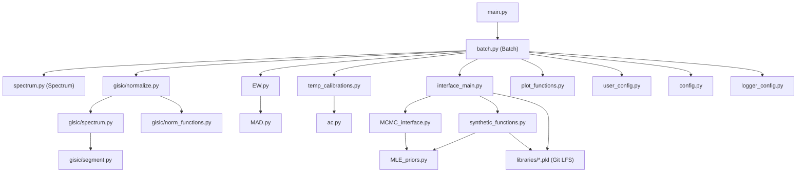

# Dependencies

## Internal Dependencies

## External Dependencies

### Runtime Dependencies (from `pyproject.toml`)

| Package | Version (pinned) | Used By | Purpose |
|---|---|---|---|
| scipy | ==1.15.3 | `gisic/spectrum.py`, `MCMC_interface.py`, `EW.py` | Spline continuum fitting, KDE-peak optimization, equivalent-width integration |
| numpy | ==2.3.0 | Throughout | Array/numeric operations |
| pandas | ==2.3.0 | `batch.py`, `spectrum.py` | Spectral frames, parameter tables, output tables |
| statsmodels | ==0.14.4 | `MCMC_interface.py` | `KDEUnivariate` posterior smoothing |
| astropy | ==7.1.0 | `spectrum.py` | FITS file I/O |
| emcee | ==3.1.6 | `interface_main.py` | MCMC ensemble sampling |
| texttable | ==1.7.0 | `batch.py` (temp/likelihood tables) | Formatted text table output |
| matplotlib | ==3.10.3 | `plot_functions.py` | Plot generation |
| corner | ==2.2.3 | `plot_functions.py` | MCMC corner plots |
| tqdm | >=4.67.1 | (progress reporting where used) | Progress bars |

### Optional Dependency Groups

| Group | Packages | Purpose |
|---|---|---|
| `dev` | ruff==0.15.5, pre-commit==4.5.1 | Linting, git hook enforcement |
| `test` | pytest, pytest-doctestplus, pytest-cov | Test running and coverage |
| `docs` | sphinx, sphinx-astropy, sphinx-automodapi, sphinx-book-theme, sphinx-rtd-theme, sphinx-copybutton, sphinx_click, myst-parser, linkify-it-py, sphinxcontrib-spelling, enchant | Documentation generation |
| `all` | union of dev, test, docs | Full contributor environment |

### External Data Dependencies (not pip packages)

| Artifact | Location | Storage | Purpose |
|---|---|---|---|
| `SYNTHETIC_SPEC_R2000_INTERP.pkl` | `casper/interface/libraries/` | Git LFS | 3D (Teff, [Fe/H], [C/Fe]) → flux interpolator for synthetic spectrum generation |
| `grav_interp.pkl` | `casper/interface/libraries/` | Git LFS | Y² isochrone-based (Teff, [Fe/H]) → log g interpolator |
| `MASTER_spec_interp.pkl` | `casper/interface/libraries/` | Git LFS | Archetype reference spectra for GI/GII/GIII classification |

**Note**: These files must be pulled explicitly via `git lfs pull` after installing `git-lfs`; they are not part of the standard git checkout.
